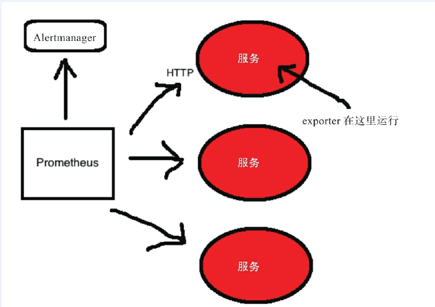

# 部署安装Prometheus

[官方quickstart](https://prometheus.io/docs/prometheus/2.18/getting_started/)

[国内yum源](https://mirrors.tuna.tsinghua.edu.cn/github-release/prometheus)

## 架构说明
每个Prometheus服务器都设计为尽可能自治，旨在支持扩展到数千台主机的数百万个时间序列的
规模。数据存储格式被设计为尽可能降低磁盘的使用率，并在查询和聚合期间快速检索时间序列。
为了速度和可靠性，建议Prometheus服务器充分使用内存（Prometheus在内存中做很多事）
和SSD磁盘。关于SSD的使用可以参考相关视频

https://www.youtube.com/watch?v=H7PJ1oeEyGg

## 下载&安装启动
当前仅提供最新的版本
2.18.1下载
下载命令
```
wget https://mirrors.tuna.tsinghua.edu.cn/github-release/prometheus/prometheus/2.18.1%20_%202020-05-07/prometheus-2.18.1.linux-amd64.tar.gz
tar xf prometheus-2.18.1.linux-amd64.tar.gz -C /app
cd /app
mv prometheus-2.18.1.linux-amd64 prometheus

[root@zabbix-server prometheus]# ./prometheus --version
prometheus, version 2.18.1 (branch: HEAD, revision: ecee9c8abfd118f139014cb1b174b08db3f342cf)
  build user:       root@2117a9e64a7e
  build date:       20200507-16:51:47
  go version:       go1.14.2

启动要加& 才能后台运行

重载配置文件
kill -hup `ps -ef |grep prometheus|grep -v grep|awk '{print $2}'`
```