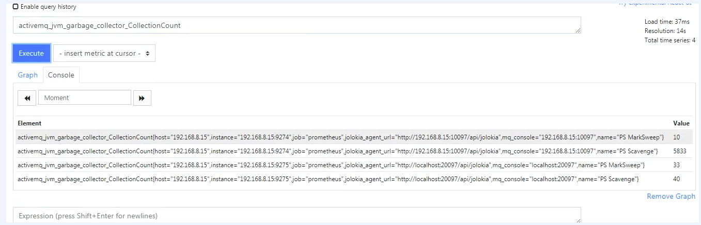

# metric\_label\_configs


Prometheus 从数据源拉取数据后，会对原始数据进行编辑；其中 metric_relabel_configs 是 Prometheus 在保存数据前的最后一步标签重新编辑（relabel_configs）。
所以，哪怕你将 metric_relabel_configs 模块放在 job_name 模块的最前端，Prometheus 解析编辑文件后，也会将 metric_relabel_configs 放在最后。
metric_relabel_configs 模块和 relabel_config 模块很相似。metric_relabel_configs 一个很常用的用途：将监控不需要的数据，直接丢掉，不在Prometheus 中保存。
重新标记操作一般常见的情况
```

  删除不必要的指标。
  从指标中删除敏感或不需要的标签。
  添加、编辑或者修改指标的标签值或者标签格式。
```
- 删除不需要的指标(metric)

Prometheus 默认会将所有拉取到的 metrics 都写入自己的存储中。如果某些 metrics 对我们并没有太多意义，可以设置直接丢掉，减少磁盘空间的浪费。‘node_netstat_Icmp_OutMsgs’ 指标数据。
```
   metric_relabel_configs:
   - source_labels: [ __name__ ]
     regex: 'node_netstat_Icmp_OutMsgs'
     action: drop
```
使用 source_labels 参数选择要要操作的指标，并且还需要一组标签名称。
示例中使用 __name__ 标签，此标签是标识指标名称的预留标签。
如上，我们丢掉指定job_name 中的
参考上面的配置，我们可以对指标(metric) 进行添加，删除，重命名等操作。
- 二、修改指标(metric) 中的标签(label)
如果我们使用 Prometheus 监控 Kubernetes 运行状态；应该会遇到，在一个 query 中结合一个以上的job_name(metric_source)的情况。
不同的job_name中metric的label命名可能不相同。比如：pod的名称可以使用“pod”或者“pod_name” 这两个 label 记录。如果相同含义的label，名称却不相同；对query的编写就很困难了。至少我没有在PromQL 中找到类似SQL 语句中的 as 的功能的关键词和方法。
这样的话，正确的解决思路应该是在 Prometheus 拉取数据后，保存数据前；将 label 的名称进行重写；保证相同含义的label 有相同的名称。
```
 metric_relabel_configs:
  - source_labels: [pod]
    separator: ;
    regex: (.+)
    target_label: pod_name
    replacement: $1
    action: replace
```
删除标签通常用于隐藏敏感信息或者简化时间序列。
```
  metric_relabel_configs:
  - regex: 'kernelVersion'
    action: labeldrop
```
增加一个replace的方法
1.先用lable_replacece 测试一下正则
```
label_replace(activemq_jvm_runtime_Uptime{},"host","$1","instance","(.*):.*")
```
2.写入配置文件
```
scrape_configs:
  # The job name is added as a label `job=<job_name>` to any timeseries scraped from this config.
  - job_name: 'prometheus'

    # metrics_path defaults to '/metrics'
    # scheme defaults to 'http'.

    static_configs:
    - targets: ['192.168.7.70:9090','192.168.8.15:9274','192.168.8.15:9275','192.168.8.15:9276']
    metric_relabel_configs:
    - source_labels: [jolokia_agent_url]
      regex: (.*)://(.*):(.*)/(.*)/(.*)
      target_label: mq_console
      replacement: $2:$3
      action: replace
    - source_labels: [instance]
      regex: (.*):.*
      target_label: host
      replacement: $1
      action: replace
  - job_name: 'java'
    file_sd_configs:
    - files: ['/app/prometheus/sd_config/tomcat.yml']
      refresh_interval: 30s
```
3验证


多了host指标，表示成功