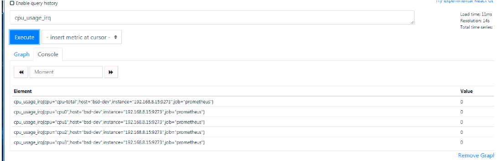

# Telegraf采集工具部署
这个是influxdb配套的一个采集工具，由于我是想把直接放到prometheus 所以没有安装influxdb
# 一、安装
- 下载安装包


当前最新版本是1.14
一般不用最新版本做学习，如果出了问题，由于版本太新一般没有解决方案
选择1.12版本
```
https://github.com/influxdata/telegraf/releases/tag/1.12.0
```

选择rpm包安装
```
wget https://dl.influxdata.com/telegraf/releases/telegraf-1.12.0-1.x86_64.rpm
```

安装
```
yum install -y telegraf-1.12.0-1.x86_64.rpm
```
# 二、配置
- 配置文件


默认在/etc/telegraf/telegraf.conf 


在启动服务前需要先编辑或者创建一个初始化配置文件，表示你需要的输入（采集的metrics来源）and 输出（把采集的指标送去哪里）
现在我们使用-input-fileter 参数和-output-filter参数


下面做个例子 ，创建一个新的配置文件temp-telegraf.conf with 两个input:一个关于cpu的采集指标一个是内存的使用采集，我使用prometheus_client作为输出
想看当前支持的输入输出插件：https://docs.influxdata.com/telegraf/v1.12/plugins/plugin-list/#output-plugins

```
 
 telegraf -sample-config -input-filter cpu:mem -output-filter prometheus_client > temp-telegraf.conf
```
# 三、启动
```
 telegraf --config temp-telegraf.conf 
2020-05-21T07:09:32Z I! Starting Telegraf 1.12.0
2020-05-21T07:09:32Z I! Loaded inputs: cpu mem
2020-05-21T07:09:32Z I! Loaded aggregators: 
2020-05-21T07:09:32Z I! Loaded processors: 
2020-05-21T07:09:32Z I! Loaded outputs: prometheus_client
2020-05-21T07:09:32Z I! Tags enabled: host=bsd-dev
2020-05-21T07:09:32Z I! [agent] Config: Interval:10s, Quiet:false, Hostname:"bsd-dev", Flush Interval:10s
^[[A^[[A^[[B^[[B
```
验证
看下有没有数据
```
[root@bsd-dev ~]# curl -s http://192.168.8.15:9273/metrics|less
# HELP cpu_usage_guest Telegraf collected metric
# TYPE cpu_usage_guest gauge
cpu_usage_guest{cpu="cpu-total",host="bsd-dev"} 0
cpu_usage_guest{cpu="cpu0",host="bsd-dev"} 0
cpu_usage_guest{cpu="cpu1",host="bsd-dev"} 0
cpu_usage_guest{cpu="cpu2",host="bsd-dev"} 0
cpu_usage_guest{cpu="cpu3",host="bsd-dev"} 0
# HELP cpu_usage_guest_nice Telegraf collected metric
# TYPE cpu_usage_guest_nice gauge
cpu_usage_guest_nice{cpu="cpu-total",host="bsd-dev"} 0
cpu_usage_guest_nice{cpu="cpu0",host="bsd-dev"} 0
cpu_usage_guest_nice{cpu="cpu1",host="bsd-dev"} 0
cpu_usage_guest_nice{cpu="cpu2",host="bsd-dev"} 0
cpu_usage_guest_nice{cpu="cpu3",host="bsd-dev"} 0
# HELP cpu_usage_idle Telegraf collected metric
```

# 配置prometheus
```
  #9273是新加的配置
  - job_name: 'prometheus'

    # metrics_path defaults to '/metrics'
    # scheme defaults to 'http'.

    static_configs:
    - targets: ['192.168.7.70:9090','192.168.8.15:9273']
```
- 页面检查

- 查看有没有指标

有值，表示测试验证成功