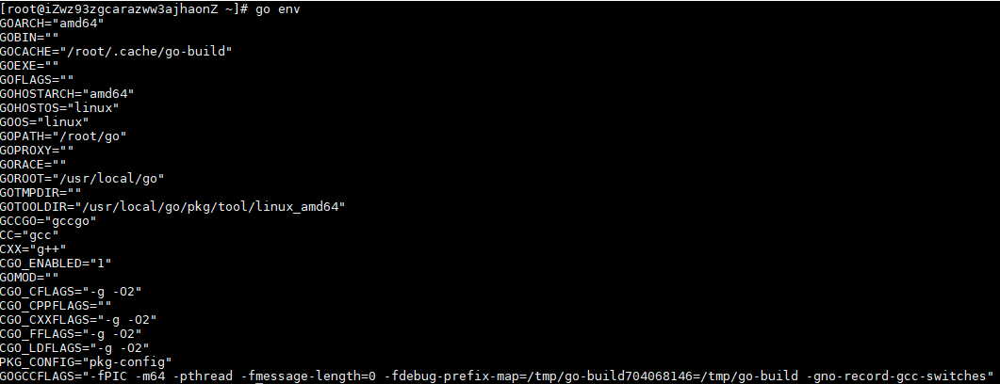

# GO语言的测试和编译

## 1.下载golang安装包
```
wget https://dl.google.com/go/go1.12.5.linux-amd64.tar.gz
```
## 2.解压至/usr/local文件夹
```
tar -C /usr/local -xzf go1.12.5.linux-amd64.tar.gz
```
### 2.1 配置环境变量vim /etc/profile
```
export GOROOT=/usr/local/go #设置为go安装的路径
export GOPATH=$HOME/go #默认安装包的路径
export PATH=$PATH:$GOROOT/bin:$GOPATH/bin
source /etc/profile使修改生效.
```
## 3.测试结果

## 4.创建文件夹
mkdir -p /root/go/src

## 0. 概述
虽然现在 Go 已经有了官方的依赖管理工具 Go Module，但是，我还是有不少项目用的是 Dep，所以还是需要持续的使用 Dep 的。
## 1. 安装 Dep
安装 Dep 有多种方式，例如可以直接使用 go install 安装，但是我嫌这种方式还需要我自己编译安装，速度稍慢，所以我选择下载直接编译完成的二进制文件的形式。
```
[root@liqiang.io]# curl https://raw.githubusercontent.com/golang/dep/master/install.sh | sh
  % Total    % Received % Xferd  Average Speed   Time    Time     Time  Current
                                 Dload  Upload   Total   Spent    Left  Speed
100  5230  100  5230    0     0   2938      0  0:00:01  0:00:01 --:--:--  2939
ARCH = amd64
OS = linux
Will install into /home/liqiang.io/src/go/bin
Fetching https://github.com/golang/dep/releases/latest..
Release Tag = v0.5.4
Fetching https://github.com/golang/dep/releases/tag/v0.5.4..
Fetching https://github.com/golang/dep/releases/download/v0.5.4/dep-linux-amd64..
Setting executable permissions.
Moving executable to /home/liqiang.io/src/go/bin/dep
```
OK，就这么简单就完成了。
## 2. 验证
```
[root@liqiang.io]# dep version
dep:
 version     : v0.5.4
 build date  : 2019-07-01
 git hash    : 1f7c19e
 go version  : go1.12.6
 go compiler : gc
 platform    : linux/amd64
 features    : ImportDuringSolve=false
```
## 3. Ref

简介
Goproxy 中国完全实现了 Go 的模块代理协议。并且它是一个由中国备受信赖的云服务提供商七牛云支持的非营利性项目。目标是为中国和世界上其他地方的 Gopher 们提供一个免费的、可靠的、持续在线的且经过 CDN 加速的模块代理。
愉快地编码吧，Gopher 们！;-)
用法
macOS 或 Linux
打开你的终端并执行：

```
$ export GOPROXY=https://goproxy.cn
或者
$ echo "GOPROXY=https://goproxy.cn" >> ~/.profile && source ~/.profile
```
完成。
## 源码编译Telegraf的方法
```
最后是在云端买了个海外服务器才能编译成功
## 安装 Go >=1.9 (1.10 recommended)
## 安装 dep ==v0.5.0　（国内同学准备吐血吧！要么挂vpn，要么手动一个个从github往下扒）
## 下载 Telegraf 源码:
go get -d github.com/influxdata/telegraf
## 尝试编译
cd "$HOME/go/src/github.com/influxdata/telegraf"
make
###

13. http_proxy="http://<proxy>" make
14. ./telegraf --help
15. ./telegraf --input-filter supervisor config > telegraf.conf
16. ./telegraf --config telegraf.conf --test

```
