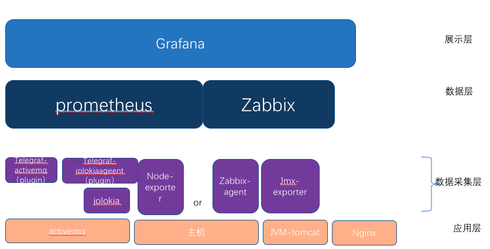

# Telegraf-jolokia2\_agent-plugin的使用

通过activemq插件只能采集部分队列相关的数据


需要通过activemq自带的jolikia采集


经测试 最新的版本5.15.12版本不可用


官方教程：https://jolokia.org/reference/html/security.html#d0e3067


mq的jolokia-acces.xml


设置地址：https://jolokia.org/reference/html/security.html


通过jolokia采集需要启动

```
<beans>
  <broker useJmx="true" xmlns="http://activemq.apache.org/schema/core">
    ...
        <managementContext>
            <managementContext createConnector="true"/>
        </managementContext>
    ...
  </broker>

  <commandAgent xmlns="http://activemq.apache.org/schema/core"/>
  ...
</beans>
```
参考其他指标的地址：https://www.cnblogs.com/nami/p/5496951.html


- 测试方式


如果提示跨域等报错
```
wget --user admin --password admin --header "Origin: http://localhost" --auth-no-challenge http://localhost:8161/api/jolokia/read/org.apache.activemq:type=Broker,brokerName=localhost
```
一般情况使用这个port为MQ控制台端口
```
curl -u system:manager http://127.0.0.1:20097/api/jolokia/
```
- 生成telegraf配置文件
```
telegraf -sample-config -input-filter jolokia2_agent -output-filter prometheus_client >jolokia2_agent-telegraf.conf
``` 
- 修改telegraf配置文件端口信息
```
###############################################################################
#                            INPUT PLUGINS                                    #
###############################################################################


# Read JMX metrics from a Jolokia REST agent endpoint

[[inputs.jolokia2_agent]]
  urls = ["http://localhost:20097/api/jolokia"]
  name_prefix = "activemq."
  username = "system"
  password = "manager"

  ### JVM Generic

  [[inputs.jolokia2_agent.metric]]
    name  = "OperatingSystem"
    mbean = "java.lang:type=OperatingSystem"
    paths = ["ProcessCpuLoad","SystemLoadAverage","SystemCpuLoad"]

  [[inputs.jolokia2_agent.metric]]
    name  = "jvm_runtime"
    mbean = "java.lang:type=Runtime"
    paths = ["Uptime"]

  [[inputs.jolokia2_agent.metric]]
    name  = "jvm_memory"
    mbean = "java.lang:type=Memory"
    paths = ["HeapMemoryUsage", "NonHeapMemoryUsage", "ObjectPendingFinalizationCount"]

  [[inputs.jolokia2_agent.metric]]
    name     = "jvm_garbage_collector"
    mbean    = "java.lang:name=*,type=GarbageCollector"
    paths    = ["CollectionTime", "CollectionCount"]
    tag_keys = ["name"]

  [[inputs.jolokia2_agent.metric]]
    name       = "jvm_memory_pool"
    mbean      = "java.lang:name=*,type=MemoryPool"
    paths      = ["Usage", "PeakUsage", "CollectionUsage"]
    tag_keys   = ["name"]
    tag_prefix = "pool_"

  ### ACTIVEMQ

  [[inputs.jolokia2_agent.metric]]
    name     = "queue"
    mbean    = "org.apache.activemq:brokerName=*,destinationName=*,destinationType=Queue,type=Broker"
    paths    = ["QueueSize","EnqueueCount","ConsumerCount","DispatchCount","DequeueCount","ProducerCount","InFlightCount"]
    tag_keys = ["brokerName","destinationName"]

  [[inputs.jolokia2_agent.metric]]
    name     = "topic"
    mbean    = "org.apache.activemq:brokerName=*,destinationName=*,destinationType=Topic,type=Broker"
    paths    = ["ProducerCount","DequeueCount","ConsumerCount","QueueSize","EnqueueCount"]
    tag_keys = ["brokerName","destinationName"]

  [[inputs.jolokia2_agent.metric]]
    name     = "broker"
    mbean    = "org.apache.activemq:brokerName=*,type=Broker"
    paths    = ["TotalConsumerCount","TotalMessageCount","TotalEnqueueCount","TotalDequeueCount","MemoryLimit","MemoryPercentUsage","StoreLimit","StorePercentUsage","TempPercentUsage","TempLimit"]
    tag_keys = ["brokerName"]
```

- 数据发送到Prometheus
  - 修改配置文件
```
# Configuration for the Prometheus client to spawn
[[outputs.prometheus_client]]
  ## Address to listen on
  listen = ":9275"
```
- 启动telegraf

```
[root@bsd-dev activeMQ-10098]# ps -ef|grep telegraf
root      4176 27285  0 14:23 pts/0    00:00:03 telegraf --config 2-jolokia2_agent-telegraf.conf
root      4755 27285  0 14:24 pts/0    00:00:00 telegraf --config jolokia2_agent-telegraf.conf
root      5720 27285  0 14:25 pts/0    00:00:00 telegraf --config temp-telegraf.conf
```
- 检查数据
```
curl -s http://127..0.0.1:9275/metrics
```
- 配置prometheus
  
省略


grafana展示

省略

