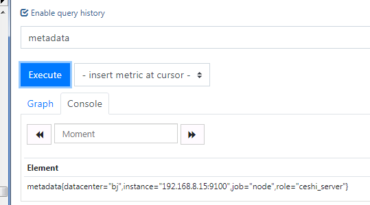

# Node-exporter（Prometheus-plugin）
# 监控主机
## 安装
```
wegt 
tar xf 
cp node_exporter-1.0.0.linux-amd64/node_exporter /usr/local/bin/
```
## 配置textfile收集器
### 可以自定义指标

- 制作元数据可以区分主机和服务

  - 创建​metadata.prom
```
  cd /app/node_exporter/textfile_collector 
metadata{role="ceshi_server",datacenter="bj"}1​
```
  - 在​启动node——exporter的可以增加下面的参数
```
--collector.textfile.directory /app/node_exporter/textfile_collector 
```
## 启用systemd收集器
- 可以只收集特定的服务指标
将特定服务列入白名单使用--collector.systemd.unit-whitelist参
数进行配置，它会匹配systemd的正则表达式

 [参考链接](https://www.freedesktop.org/wiki/Software/systemd)

- 过滤收集器
```
params:
​  collect[]:#y搜索一下 关键字​
```

- 测试收集参数
```
curl -g -X GET http://xxx.xxx.xxx.xx:9990/metrics?collect[]=cpu
```
## 启动命令
```
node_exporter --collector.textfile.directory /app/node_exporter/textfile_collector --collector.systemd --collector.systemd.unit-whitelist="(ssh|activemq-10098).service"  &
```
### 重新加载配置文件
```
kill -hup `ps -ef |grep prometheus|grep -v grep|awk '{print $2}'`
```