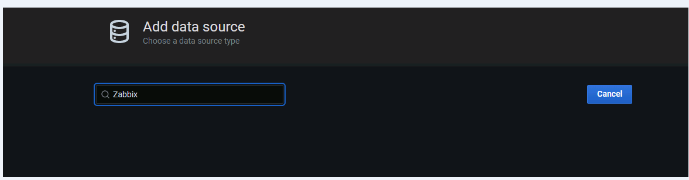
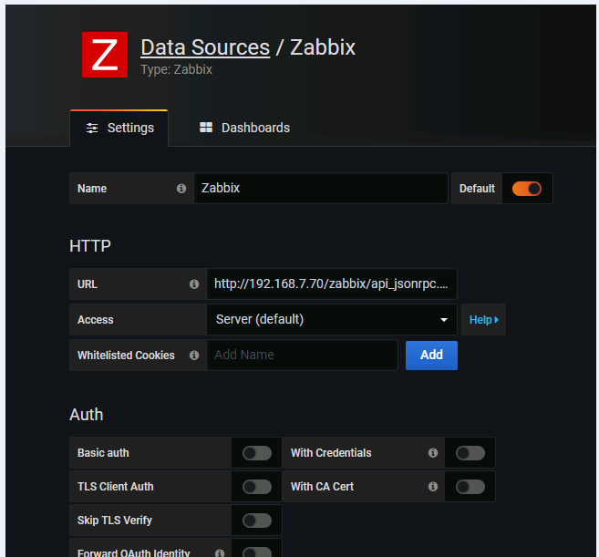
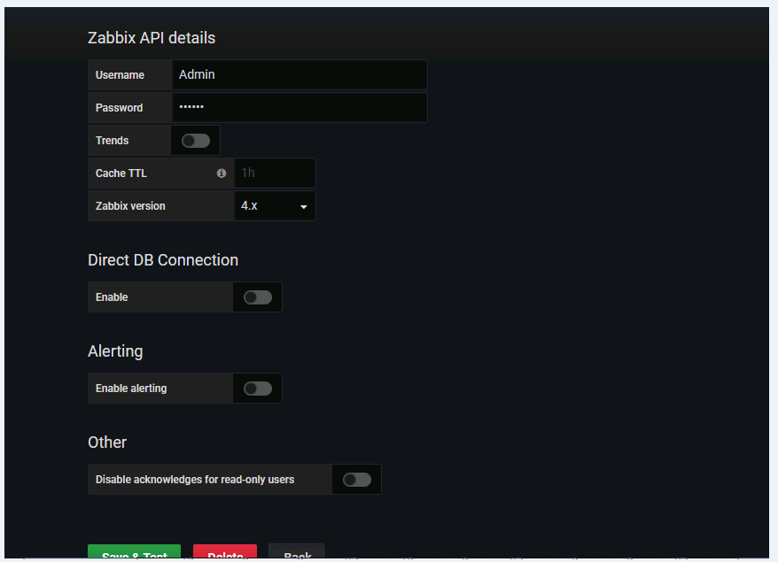

# 部署安装Grafana
```
vim /etc/yum.repos.d/grafana.repo
[grafana]
name=grafana
baseurl=https://mirrors.tuna.tsinghua.edu.cn/grafana/yum/rpm
repo_gpgcheck=0
enabled=1
gpgcheck=0

2.
 	yum makecache

3.//
yum install -y grafana

systemctl start grafana-server
```
## 安装-grafana-zabbix插件
参考链接
https://alexanderzobnin.github.io/grafana-zabbix/guides/gettingstarted/

模板
https://alexanderzobnin.github.io/grafana-zabbix/guides/templating/

4.插件启动前
https://grafana.com/grafana/plugins/alexanderzobnin-zabbix-app/installation

启动中
```
[root@zabbix-server zabbix]# grafana-cli plugins install alexanderzobnin-zabbix-app
installing alexanderzobnin-zabbix-app @ 3.11.0
from: https://grafana.com/api/plugins/alexanderzobnin-zabbix-app/versions/3.11.0/download
into: /var/lib/grafana/plugins

✔ Installed alexanderzobnin-zabbix-app successfully 

Restart grafana after installing plugins . <service grafana-server restart>
```
启动后

需要点击插件-选择插件zabbix
点击enable 回到datasource
设置datasource



点击保存

dashbord下载链接
https://grafana.com/grafana/dashboards?dataSource=alexanderzobnin-zabbix-datasource&orderBy=name&direction=asc