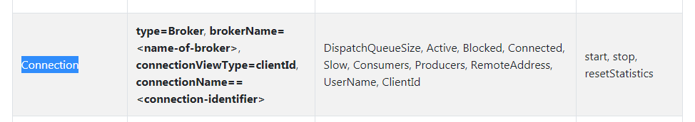
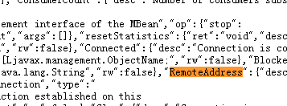
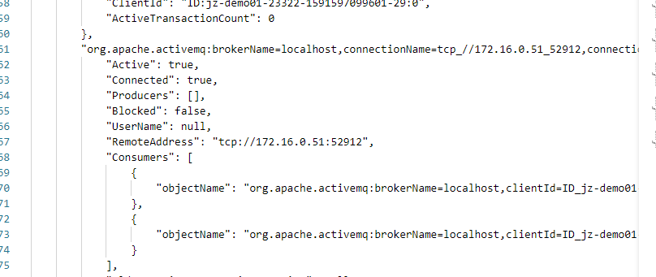

如何正确使用activemq jmx
首先activemq 默认有一个rest的api
http://ip:console-port/api/jolokia

如何获取想看的信息
首先需要查看官网
http://activemq.apache.org/jmx.html

比如想看connection

http://39.107.105.33:10097/api/jolokia/list

在这个页面查询相关的属性
比如remoteaddress

得到的信息太繁杂了
整个页面拿出来放到vscode的软件利用插件jsontool 格式json数据得到的结果如下

从而得到mbean
org.apache.activemq:brokerName=localhost,connectionName=tcp_//172.16.0.51_52912,connectionViewType=remoteAddress,connector=clientConnectors,connectorName=openwire,type=Broker

为了查看所有connectionname，改造一下

org.apache.activemq:brokerName=*,connectionName=*,connectionViewType=remoteAddress,connector=clientConnectors,connectorName=openwire,type=Broker

拼接一下 url得到
http://39.107.105.33:10097/api/jolokia/read/org.apache.activemq:brokerName=×,connectionName=*,connectionViewType=remoteAddress,connector=clientConnectors,connectorName=openwire,type=Broker

直接放到浏览器访问即可